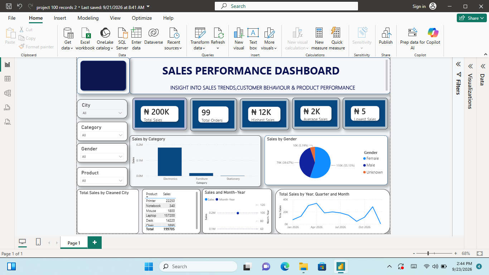

# Chizelunwa Chidera Rita

## Sales Performance Analysis

A sales analysis project covering data cleaning, SQL querying, and dashboard design, built as part of an 8-week Data Analytics program.

## Project Overview

This project analyzes 99 sales orders (January–December 2026) to answer key business questions: which products, cities and customer groups drive revenue, and where the business is losing sales. The raw dataset was intentionally messy (inconsistent spacing, mixed capitalization, missing values), so the first stage of the project was cleaning it before any analysis could begin.

**Tools used:** Excel, SQL Server, Power BI

## What I did

- **Cleaned the raw dataset** in Excel: standardized text fields, fixed inconsistent date formats, handled missing and invalid values, and added calculated columns (Total Sales, Performance rating)
- **Built pivot tables and charts** in Excel to summarize sales by category, city, gender, and product
- **Wrote SQL queries** to aggregate sales, rank top products, filter by customer segment, and answer specific business questions
- **Built an interactive Power BI dashboard** with KPI cards, a sales-by-category chart, a gender breakdown, a city map, and a monthly sales trend, all filterable by city, category, gender, and product

## Key Findings

- **Electronics drives the business:** 90.8% of all revenue, almost entirely from Laptops (78.7% of total sales on their own)
- **Female customers account for 55%** of sales, against 40% from male customers
- **Accra and Kumasi together bring in 53%** of sales, the two strongest markets
- **Sales are highly seasonal:** peaks in April and July, then a near-total collapse in September and October before recovering by year-end
- **Two salespeople (Emeka and Diana) drive 71% of revenue**, and just 50 of the 99 orders account for 97.5% of total sales

Full findings and business recommendations are in the report below.

## Files in this repository

| File | Description |
|---|---|
| [`my final analysis.xlsx`](my%20final%20analysis.xlsx) | Raw data, cleaned data, analysis formulas, pivot tables and charts |
| [`SQLQuery project assignment.sql`](SQLQuery%20project%20assignment.sql) | SQL queries used for the analysis |
| [`project 100 records 2.pbix`](project%20100%20records%202.pbix) | Power BI file with the full interactive dashboard |
| [`Sales Performance Report.pdf`](Sales%20Performance%20Report.pdf) | Full write-up: methodology, findings, and recommendations |
| [`Data Analysis Project (4).docx`](Data%20Analysis%20Project%20%284%29.docx) | Original assignment brief |
| [`2026-09-23.png`](2026-09-23.png) | Dashboard screenshot |

## About Me

Recent Accounting graduate with hands-on training in data analytics (Excel, SQL, Power BI). This project reflects my ability to take a messy, real-world dataset from raw data through to a finished, decision-ready dashboard. Looking for an internship or entry-level role where I can keep building these skills.

[LinkedIn](https://www.linkedin.com/in/chidera-chizelunwa) · [Email](mailto:cchizelunwa@gmail.com)